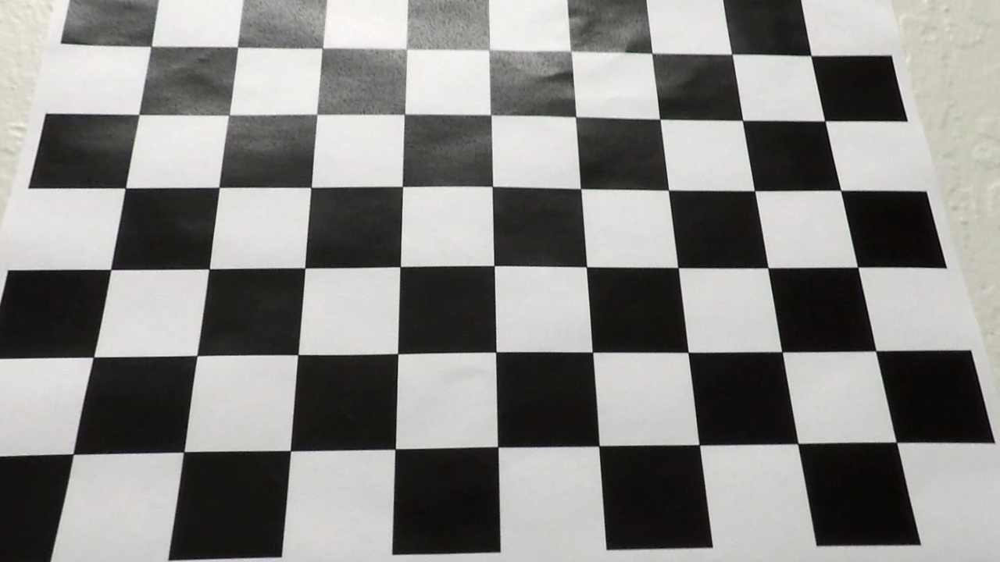
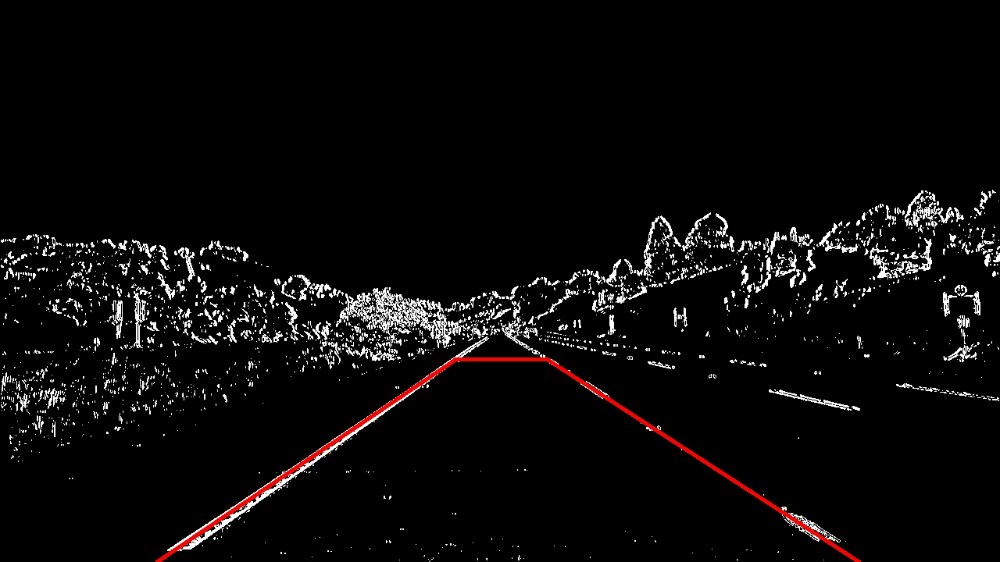

## Project: Advanced Lane Finding

### Project Goals/Steps

The goals / steps of this project are the following:

* Step 1: Compute the camera calibration matrix and distortion coefficients given a set of chessboard images.
* Step 2: Apply a distortion correction to raw images.
* Step 3: Use color transforms, gradients, etc., to create a thresholded binary image.
* Step 4: Apply a perspective transform to rectify binary image ("birds-eye view").
* Step 5: Detect lane pixels and fit to find the lane boundary.
* Step 6: Determine the curvature of the lane and vehicle position with respect to center.
* Step 7: Warp the detected lane boundaries back onto the original image.
* Step 8: Output visual display of the lane boundaries and numerical estimation of lane curvature and vehicle position.

### From Previous Projects

In the previous Lane Finding project, the lane lines in a frame was found with the following steps

* Step 1: convert the image to gray scale
* Step 2: apply gaussian_blur to smooth the image
* Step 3: apply Canny edge detection algorithm
* Step 4: apply mask filter
* Step 5: find lines using Hough transform

When I apply this approach to the video for this project, I get [this result](./test_videos/project_video_pre-full.mp4). Overall, the result is very jittery and even fails to follow the real lane lines when the road color changes or there are shadow on the road. For example, frames near 20 seconds and 40 seconds.

Let's see if we can improve the result using more advanced algorithms.


### 1. Compute the camera matrix and distortion coefficients

Images formed through the camera lenses are distorted, especially around the edge of the images. This kind of distortion can be calibrated using chessboard images. Calibration means finding out the translation vector and rotation vector. Once these values are found, then the distored images can be undistorted using the precomputed translation and rotation vectors.

The first step is to find out the "corner points" using `cv2.findChessboardCorners()` function. The found corner points can easily be drawn on the original image using `cv2.drawChessboardCorners()`


Then the translation and rotation vectors between object points and image points are found using `cv2.calibrateCamera()` function.

### 2. Apply a distortion correction to raw images.

Once the calibration parameters (translation and rotation vectors) are found, then the original images can be undistorted using `cv2.undistort()`. The following image is the undistorted version of the image above.



Video images captured by the same camera can now be undistorted using these calibration parameters. These numbers do not need to be recomputed after they are computed once.

 

### 3. Create a thresholded binary image.


### Pipeline (single images)

#### 1. Provide an example of a distortion-corrected image.

To demonstrate this step, I will describe how I apply the distortion correction to one of the test images like this one:
![alt text][image2]

#### 2. Describe how (and identify where in your code) you used color transforms, gradients or other methods to create a thresholded binary image.  Provide an example of a binary image result.

I used a combination of color and gradient thresholds to generate a binary image (thresholding steps at lines # through # in `another_file.py`).  Here's an example of my output for this step.  (note: this is not actually from one of the test images)

![alt text][image3]

#### 3. Describe how (and identify where in your code) you performed a perspective transform and provide an example of a transformed image.

The code for my perspective transform includes a function called `warper()`, which appears in lines 1 through 8 in the file `example.py` (output_images/examples/example.py) (or, for example, in the 3rd code cell of the IPython notebook).  The `warper()` function takes as inputs an image (`img`), as well as source (`src`) and destination (`dst`) points.  I chose the hardcode the source and destination points in the following manner:

```python
src = np.float32(
    [[(img_size[0] / 2) - 55, img_size[1] / 2 + 100],
    [((img_size[0] / 6) - 10), img_size[1]],
    [(img_size[0] * 5 / 6) + 60, img_size[1]],
    [(img_size[0] / 2 + 55), img_size[1] / 2 + 100]])
dst = np.float32(
    [[(img_size[0] / 4), 0],
    [(img_size[0] / 4), img_size[1]],
    [(img_size[0] * 3 / 4), img_size[1]],
    [(img_size[0] * 3 / 4), 0]])
```

This resulted in the following source and destination points:

| Source        | Destination   | 
|:-------------:|:-------------:| 
| 585, 460      | 320, 0        | 
| 203, 720      | 320, 720      |
| 1127, 720     | 960, 720      |
| 695, 460      | 960, 0        |

I verified that my perspective transform was working as expected by drawing the `src` and `dst` points onto a test image and its warped counterpart to verify that the lines appear parallel in the warped image.

![alt text][image4]

#### 4. Describe how (and identify where in your code) you identified lane-line pixels and fit their positions with a polynomial?

Then I did some other stuff and fit my lane lines with a 2nd order polynomial kinda like this:

![alt text][image5]

#### 5. Describe how (and identify where in your code) you calculated the radius of curvature of the lane and the position of the vehicle with respect to center.

I did this in lines # through # in my code in `my_other_file.py`

#### 6. Provide an example image of your result plotted back down onto the road such that the lane area is identified clearly.

I implemented this step in lines # through # in my code in `yet_another_file.py` in the function `map_lane()`.  Here is an example of my result on a test image:

![alt text][image6]

---

### Pipeline (video)

#### 1. Provide a link to your final video output.  Your pipeline should perform reasonably well on the entire project video (wobbly lines are ok but no catastrophic failures that would cause the car to drive off the road!).

Here's a [link to my video result](./project_video.mp4)

---

### Discussion

#### 1. Briefly discuss any problems / issues you faced in your implementation of this project.  Where will your pipeline likely fail?  What could you do to make it more robust?

Here I'll talk about the approach I took, what techniques I used, what worked and why, where the pipeline might fail and how I might improve it if I were going to pursue this project further.  
