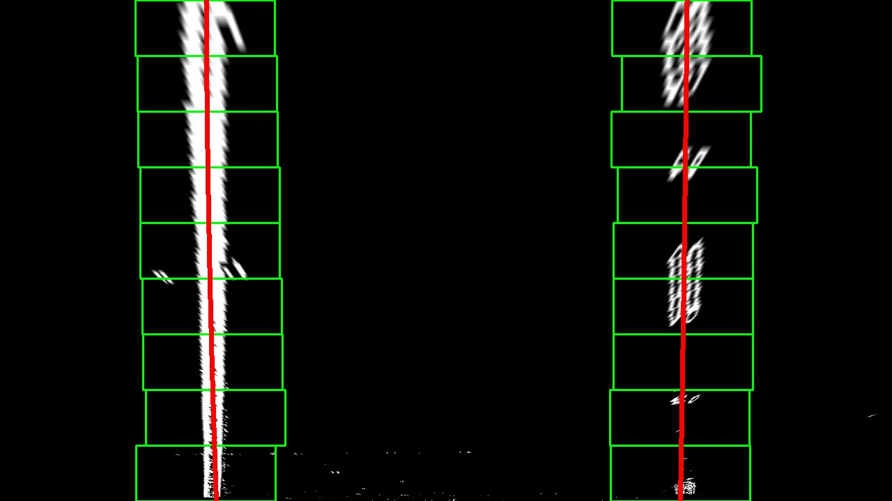

## Project: Advanced Lane Finding

### Project Goals/Steps

The goals / steps of this project are the following:

* Step 1: Compute the camera calibration matrix and distortion coefficients given a set of chessboard images.
* Step 2: Apply a distortion correction to raw images.
* Step 3: Use color transforms, gradients, etc., to create a thresholded binary image.
* Step 4: Apply a perspective transform to rectify binary image ("birds-eye view").
* Step 5: Detect lane pixels and fit to find the lane boundary.
* Step 6: Determine the curvature of the lane and vehicle position with respect to center.
* Step 7: Warp the detected lane boundaries back onto the original image.
* Step 8: Output visual display of the lane boundaries and numerical estimation of lane curvature and vehicle position.

### Result using algorithm from the previous project

In the previous Lane Finding project, the lane lines in a frame was found with the following steps

* Step 1: convert the image to gray scale
* Step 2: apply gaussian_blur to smooth the image
* Step 3: apply Canny edge detection algorithm
* Step 4: apply mask filter
* Step 5: find lines using Hough transform

You can find out the resulting video by clicking the link below. Overall, the result is very jittery and even fails to follow the real lane lines when the road color changes or there are shadow on the road. For example, frames near 20 seconds and 40 seconds.

---

    <a href="./test_videos/project_video_pre-full.mp4">Video</a>

---

Let's see if we can improve the result using more advanced algorithms.

### Step 1. Compute the camera matrix and distortion coefficients

Images formed through the camera lenses are distorted, especially around the edge of the images. This kind of distortion can be calibrated using chessboard images. Calibration means finding out the translation vector and rotation vector. Once these values are found, then the distored images can be undistorted using the precomputed translation and rotation vectors.

The first step is to find out the "corner points" using `cv2.findChessboardCorners()` function. The found corner points can easily be drawn on the original image using `cv2.drawChessboardCorners()`

Then the translation and rotation vectors between object points and image points are found using `cv2.calibrateCamera()` function.

### Step 2. Apply a distortion correction to raw images.

Once the calibration parameters (translation and rotation vectors) are found, then the original images can be undistorted using `cv2.undistort()`. The following image is the undistorted version of the image above.

Original image             |  Undistorted image
:-------------------------:|:-------------------------:
  |  

Video images captured by the same camera can now be undistorted using these calibration parameters. These numbers do not need to be recomputed after they are computed once. For example, the same calibration parameters are used to undistort the following image.

Original image             |  Undistorted image
:-------------------------:|:-------------------------:
  |  

### Step 3. Create a thresholded binary image.

Once the frame image is undistorted, then the next step is to convert the image to thresholded binary image. I basically used two approaches: applying threshold to gradient and color. Pixels identified by two approaches are combined together to form a thresholded binary image.

#### Thresholding gradient

Gradient is a rate of change in color space. Canny edge detection uses the same idea but we dont have have fine control about what happens inside Canny edge detection function of OpneCV library. Instead, I used `cv2.Sobel()` function to compute first order gradient in x-direction. The solbel function is applied on L channel of HLS color space. L channel is used since lane line pixels can be identified relatively easily even if environment such as pavement color changes. x-direction gradient is used since lane line is usually in vertical direction. Threshold value of (20, 100) is used.

#### Thresholding color

S channel is used for thresholding color for the same reason that lane line pixels can be identified relatively easily even if environment such as pavement color changes. Threshold value of (170, 255) is used.

Example of thresholded binary image is shown below. For the reader, pixels identified by gradient threshold is shown in green color while pixels identified by color threshold is shown in red color.

Undistorted image             |  Thresholded image
:-------------------------:|:-------------------------:
  |  

### Step 4. Apply a perspective transform

The next step is to do perspective transform to obtain the warped image. In warped image (bird's eye view), it is easier to find out the pixels for lane lines and compute curvature. The perspective trnasform is done by providing the function `cv2.getPerspectiveTransform()` with source points and destination points. Then the function returns the matrix M that we can use to perform perspective transform on each frame image. The image below shows the manually selected source points and the warped image.

Thresholded image with source points         |  Warped image
:-------------------------:|:-------------------------:
  |  

I can tell that the perspective transform is done reasonably well since two lane lines in the warped image appear parallel.

### Step 5. Detect lane pixels and fit to find the lane boundary

The first step to detect lane pixels in the warped image is to compute histogram (using only the bottom half of the image) in x direction and find out the two x coordinates, one that has the peak value in the left half and the other that has the peak value in the right half. These x coordinates serve as the starting point to search the lane pixels from the bottom. Next, divide the y-range into n windows (9 windows in my case). The width of each window is preset value (200 pixels in my case) centered around the a-priori x coordinates. These windows are shown in the figure below with green lines. Find out the non-zero pixels within the window and compute the average x-coordinates of these pixels. This becomes the a-priori x coordinates for the next window. Keep doing this for all the windows and collect x- and y-coordinates of all non-zero pixels within the windows. Pixels for left line and right line should be treated separately. Next, compute the fitting curve as the second order polynomial using `np.polyfit()` function using the collected x- and y-coordinates. The fitting curves for left and right lines are shown below with red lines.

Warped image         |  Warped image with fitting curves
:-------------------------:|:-------------------------:
  |  

The algorith described above is done on the first frame. Once the fitting curve is found, then we don't need to use the n-windows approach to find out the lane pixels. We can simply search the vicinity of the fitting curve and find out the lane pixels at once. This approach is faster than n-windows search and allows more stable results since the information from the previous frame is used for the current frame. The default search area suggested by the class note was 100 pixels. But this resulted in very unstable and erroneous lane detection for the project video. I changed the value from 100 pixels to 30 pixels and the result was satisfactory.

### Step 6. Determine the curvature of the lane and vehicle position with respect to center

Assuming that the fitting curve in the warped image is represented as f(y) = Ay\*\*2 + By + C

### Putting everything together

---

    <a href="./test_videos/project_video_out_updated_full.mp4">Video</a>

---

### Discussion

Briefly discuss any problems / issues you faced in your implementation of this project.  Where will your pipeline likely fail?  What could you do to make it more robust?

Here I'll talk about the approach I took, what techniques I used, what worked and why, where the pipeline might fail and how I might improve it if I were going to pursue this project further.  
